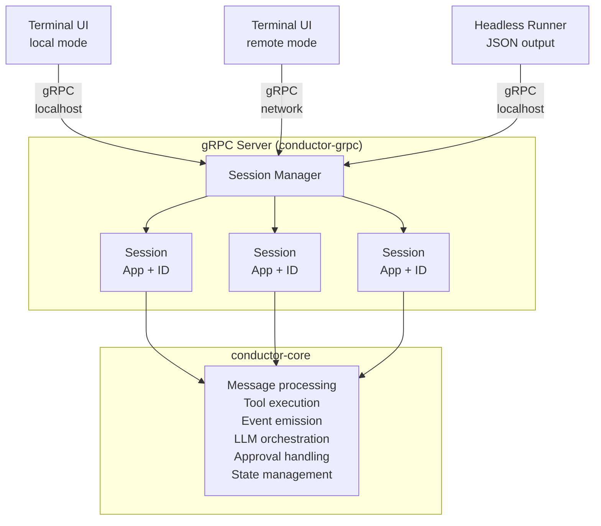
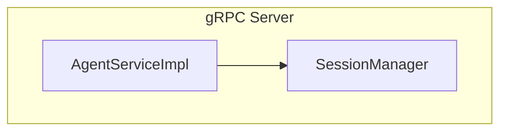
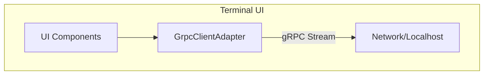
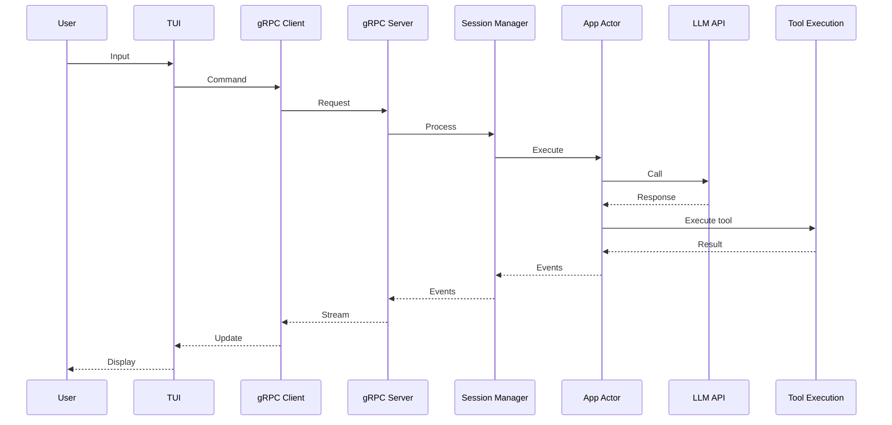
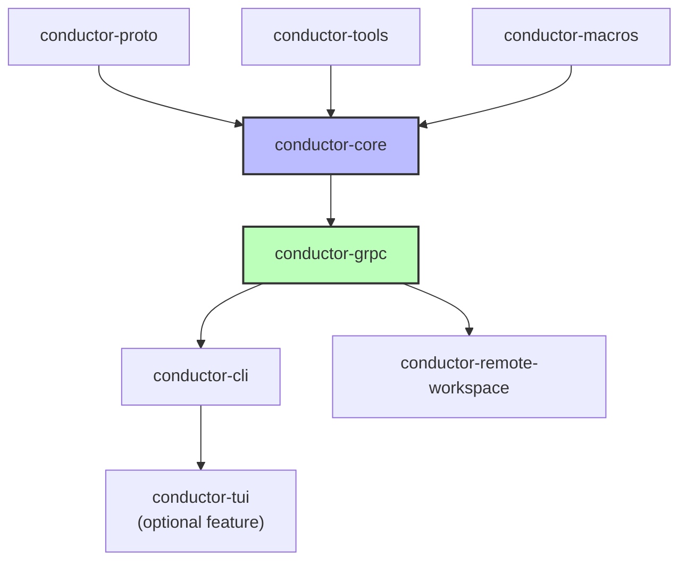

# Conductor - Architecture

This document outlines the architecture of Conductor, an AI-powered CLI assistant for software engineering tasks.

## Overview

Conductor implements a clean client/server architecture where all clients communicate through gRPC:

1. **Local Interactive**: Terminal UI connects to a localhost gRPC server
2. **Remote Interactive**: Terminal UI connects to a remote gRPC server
3. **Headless**: One-shot execution that outputs JSON (also uses gRPC internally)

This design ensures:
- Single API surface for all clients
- No in-process shortcuts or special cases
- Clear separation between UI and core logic
- Easier testing and debugging

## High-Level Architecture



## Core Components

### 1. Terminal UI (`conductor-tui`)
- **ratatui-based** terminal interface
- Always communicates through gRPC (even in local mode)
- Uses `GrpcClientAdapter` to translate between UI events and gRPC messages
- Handles user input, text editing, and tool approval prompts
- In local mode: connects to localhost gRPC server (random port)
- In remote mode: connects to network gRPC server

### 2. App Actor Loop (`conductor-core/src/app`)
The heart of Conductor - an event-driven actor that:
- Manages conversation state
- Coordinates with LLM providers (Anthropic, OpenAI, Gemini)
- Executes tools through `ToolExecutor`
- Handles tool approval flow
- Emits events for UI updates

Key structures:
- `App`: Main actor struct with conversation state, tool executor, API client
- `OpContext`: Tracks active operations and enables cancellation
- `AgentExecutor`: Manages LLM API calls and streaming responses

### 3. Session Manager (`conductor-core/src/session`)
- Multiplexes multiple App instances (sessions)
- Persists conversations to SQLite (`~/.conductor/conductor.sqlite`)
- Handles session lifecycle (create, resume, delete)
- Manages tool approval policies per session

### 4. Tool System (`conductor-tools`, `conductor-core/src/tools`)
Tools are implemented as async functions that can:
- Read/write files (`view`, `edit`, `replace`)
- Search code (`grep`, `glob`)
- Execute commands (`bash`)
- Manage tasks (`todo`)

Tool execution flow:
1. LLM requests tool via `ToolCall`
2. `ToolExecutor` checks if approval needed
3. If needed, UI prompts user for approval
4. Tool runs on selected backend (local, remote, container)
5. Result returned to LLM as `Message::Tool`

### 5. Workspace Abstraction (`conductor-core/src/workspace`)

Workspaces provide a unified interface for tool execution and environment information, abstracting over different execution contexts:

#### Workspace Types

1. **LocalWorkspace**: Executes tools in the current directory
   - Direct filesystem access
   - Environment info collected from local machine
   - Tools run in the same process

2. **RemoteWorkspace**: Executes tools on a remote machine via gRPC
   - Connects to a `conductor-remote-workspace` service
   - Environment info fetched via RPC
   - Tools executed on the remote host
   - Supports authentication (basic auth, bearer tokens)

3. **ContainerWorkspace** (planned): Execute tools in Docker containers
   - Isolated execution environment
   - Consistent tool behavior across platforms

#### Workspace Interface

```rust
#[async_trait]
trait Workspace {
    // Get environment info (working directory, git status, etc.)
    async fn environment(&self) -> Result<EnvironmentInfo>;

    // Execute a tool in this workspace
    async fn execute_tool(&self, tool_call: &ToolCall, ctx: ExecutionContext) -> Result<String>;

    // List available tools
    async fn available_tools(&self) -> Vec<ToolSchema>;

    // Check if a tool requires approval
    async fn requires_approval(&self, tool_name: &str) -> Result<bool>;
}
```

#### Environment Caching

- Environment info is cached with a TTL (5 minutes default)
- Cache can be invalidated on-demand
- Reduces overhead for frequently accessed info

#### Remote Workspace Protocol

Remote workspaces use a dedicated gRPC service (`RemoteWorkspaceService`):

```proto
service RemoteWorkspaceService {
  rpc GetEnvironmentInfo(...) returns (EnvironmentInfo);
  rpc ExecuteTool(stream ExecuteToolRequest) returns (stream ExecuteToolResponse);
  rpc GetAvailableTools(...) returns (ToolSchemasResponse);
}
```

This enables:
- Secure remote code execution
- Tool output streaming
- Cancellation support
- Authentication and authorization

## gRPC Protocol

The gRPC protocol enables client/server separation using bidirectional streaming:

### Server Side

The gRPC server can run in two modes:

1. **Standalone** (`conductor serve`):
   - Listens on a network port (default 50051)
   - Accepts connections from remote clients
   - Persistent across client connections

2. **Local** (used by local TUI and headless):
   - Binds to localhost with a random port
   - Client and server run in the same process
   - Uses TCP over loopback interface (127.0.0.1)
   - Lifetime tied to the client process



The server:
- Hosts SessionManager with multiple App instances
- Streams events to connected clients
- Handles session persistence
- Manages concurrent sessions

### Client Side (`conductor --remote`)


The client:
- Connects to server address
- Translates AppCommands → gRPC ClientMessages
- Translates gRPC ServerEvents → AppEvents
- Maintains bidirectional stream for real-time updates

### Protocol Flow

1. **Session Creation**:
   ```mermaid
   sequenceDiagram
       Client->>Server: CreateSessionRequest
       Server-->>Client: SessionInfo
   ```

2. **Bidirectional Streaming**:
   ```mermaid
   sequenceDiagram
       Client->>Server: StreamSession(stream)
       Client->>Server: Subscribe
       Server-->>Client: MessageAddedEvent
       Client->>Server: SendMessage
       Server-->>Client: ThinkingStartedEvent
       Server-->>Client: MessagePartEvent
       Server-->>Client: RequestToolApproval
       Client->>Server: ToolApprovalResponse
       Server-->>Client: ToolCallStartedEvent
       Server-->>Client: ToolCallCompletedEvent
   ```

3. **Message Types**:
   - **ClientMessage**: Commands from UI (SendMessage, ToolApproval, Cancel)
   - **ServerEvent**: Updates to UI (MessageAdded, ToolCallStarted, Error)

### Remote Workspace Protocol

For remote tool execution, a separate gRPC service handles workspace operations:

```proto
service RemoteWorkspaceService {
  rpc GetEnvironment(...) returns (EnvironmentInfo);
  rpc ExecuteTool(...) returns (ToolResult);
  rpc GetAvailableTools(...) returns (ToolList);
}
```

## Event Flow

Since all clients communicate through gRPC, the event flow is unified:

### All Modes (Local and Remote)


The difference between local and remote modes:
- **Local**: gRPC uses localhost TCP connection (127.0.0.1 with random port)
- **Remote**: gRPC uses TCP/IP network connection to specified host/port

## Key Design Decisions

1. **Unified gRPC Interface**: All clients (local TUI, remote TUI, headless) communicate through the same gRPC API, ensuring consistency and eliminating special cases
2. **Actor Model**: The App runs as an async actor with message passing, avoiding shared mutable state
3. **Event Sourcing**: All UI updates driven by events, making the system debuggable and testable
4. **Tool Abstraction**: Tools are provider-agnostic and can run on different backends
5. **Workspace Abstraction**: Unified interface for local/remote/container execution environments
6. **Session Persistence**: SQLite provides reliable storage without external dependencies
7. **Streaming gRPC**: Enables real-time updates and interactive tool approval flows
8. **Clean Crate Separation**: Each crate has a single responsibility with clear dependency boundaries

## Data Flow Examples

### Sending a Message
1. User types message in TUI
2. TUI sends `AppCommand::ProcessUserInput`
3. App adds `Message::User` to conversation
4. App calls LLM API with conversation history
5. LLM response streams back as `MessagePart` events
6. TUI renders updates in real-time

### Tool Execution with Approval
1. LLM returns `ToolCall` in response
2. App checks if tool needs approval
3. If yes, emits `RequestToolApproval` event
4. TUI shows approval prompt
5. User approves/denies
6. App executes tool (if approved)
7. Tool result added to conversation
8. LLM continues with tool result

## File Structure

```
conductor/
├── crates/
│   ├── conductor-cli/          # Command-line interface and main binary
│   ├── conductor-core/         # Core domain logic (LLM APIs, session management)
│   ├── conductor-grpc/         # gRPC server/client implementation
│   ├── conductor-macros/       # Procedural macros for tool definitions
│   ├── conductor-proto/        # Protocol buffer definitions and generated code
│   ├── conductor-remote-workspace/  # gRPC service for remote tool execution
│   ├── conductor-tools/        # Tool trait definitions and implementations
│   └── conductor-tui/          # Terminal UI library (ratatui-based)
├── migrations/                 # Database migration files
├── prompts/                    # System prompts for various models
├── proto/                      # Protocol buffer source files
└── scripts/                    # Build and development scripts
```

## Crate Dependency Graph

The crates maintain a strict acyclic dependency graph:



Key principles:
- **conductor-proto**: No dependencies on other conductor crates
- **conductor-core**: Can import proto, tools, and macros, but NOT grpc
- **conductor-grpc**: The ONLY crate that converts between core and proto types
- **Client crates** (cli, tui): Must use grpc, never import core directly
