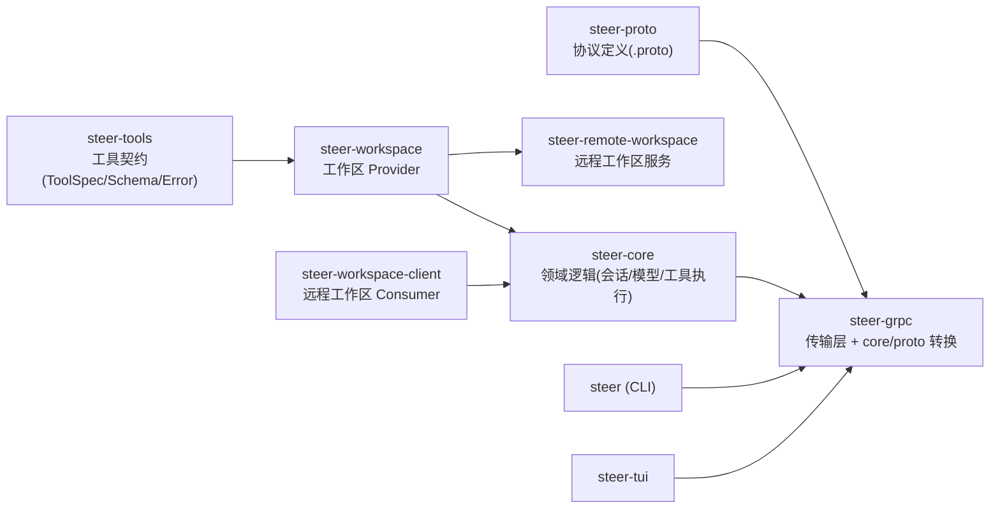
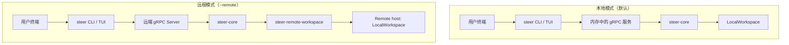
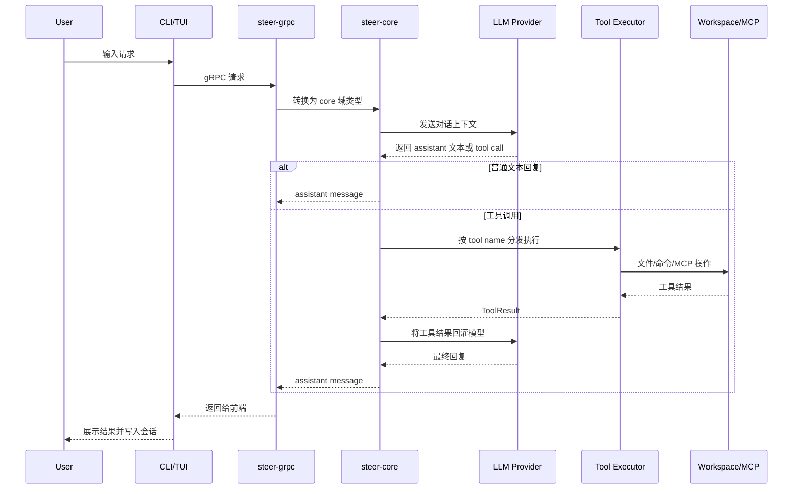
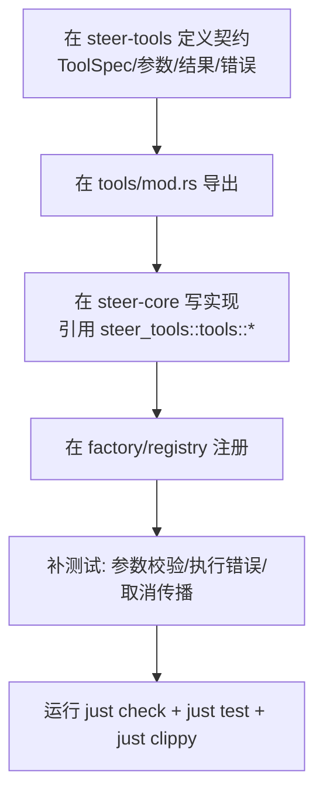
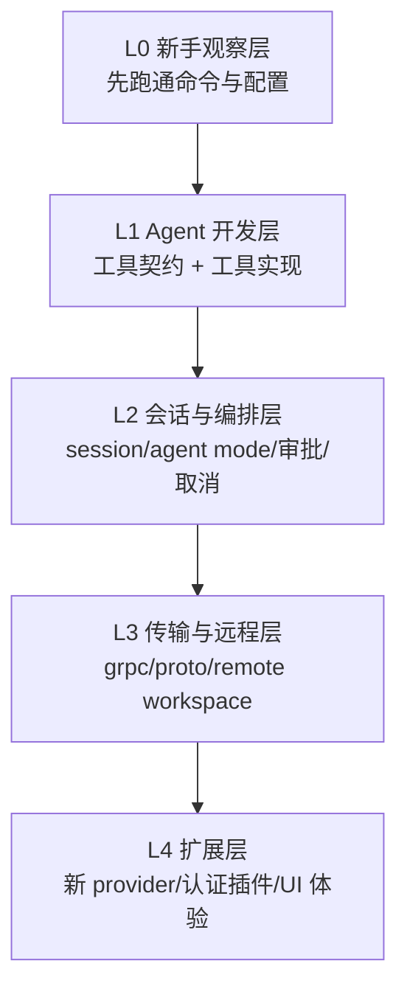
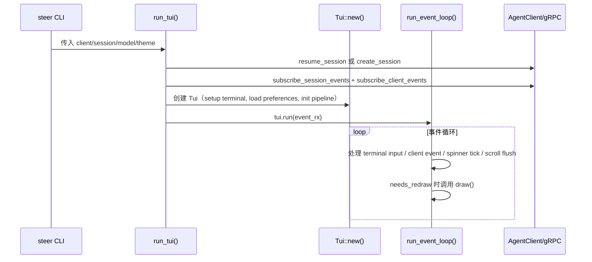
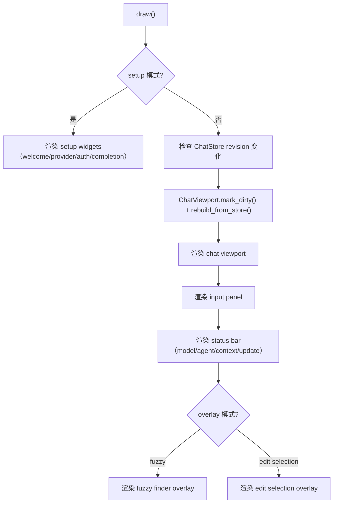

# Steer 代码库入门：面向零基础 Agent 开发者

本文档面向**第一次参与 Steer 项目**的开发者（包括人类工程师与在仓库内协作的 AI 编程助手）。阅读后，你应能说出「这个项目做什么」「代码怎么分层」「改功能该动哪些 crate」「有哪些不可违反的约定」。

---

## 1. Steer 是什么

**Steer** 是一个用 Rust 实现的 **AI 编程 Agent（智能体）** 应用：它连接大语言模型（Claude、OpenAI、Gemini、Grok 等），通过 **工具（tools）** 读写代码库、执行命令、抓取网页，并可在终端里提供 **TUI** 交互，也支持 **无界面（headless）** 与 **gRPC 服务模式**。

从用户视角，它和「在终端里聊天的编程助手」类似；从开发者视角，它是多 crate 的 **异步 Rust 服务 + 客户端**，核心逻辑与 UI、网络边界划分得很清楚。

**建议先读**：仓库根目录的 [`README.md`](../README.md) 了解功能列表、CLI 用法与配置；**开发约定**以根目录 [`AGENTS.md`](../AGENTS.md) 为准（本教程会提炼要点，细节仍以 `AGENTS.md` 为准）。

---

## 2. 你需要的前置知识（零基础清单）

不必全部精通，但越熟悉越省力：

| 领域 | 最低要求 | 说明 |
|------|-----------|------|
| **Rust** | 会读 `struct`/`enum`/`trait`、`async`/`await`、`Result`/`?` | 项目使用 **Edition 2024**，Clippy 较严（如禁止 `unwrap`/`panic!` 等） |
| **异步** | 知道 `tokio` 运行时、任务与 `Future` | 大量 API 是 `async` 的 |
| **AI Agent 概念** | 知道「模型 ↔ 多轮对话 ↔ 工具调用」 | Steer 把「调模型」和「执行工具」拆开，并有审批 / 模式（normal / plan / yolo） |
| **gRPC / Protobuf** | 有概念即可 | 客户端与「核心能力」之间通过 gRPC 通信，类型在 `steer-proto` |
| **jj / git** | 基础命令 | 工作区与 VCS 集成是产品特性之一 |

若你完全没写过 Rust：建议先完成 [Rust Book](https://doc.rust-lang.org/book/) 前 10 章，再回来看本仓库。

---

## 3. 开发环境怎么搭

### 3.1 工具链

- **Rust**：使用 `rustup` 安装，与 `Cargo.toml` 中 `edition = "2024"` 匹配的 toolchain。
- **Just**：仓库用 `justfile` 封装常用命令（见下一节）。
- **可选 Nix**：仓库含 `flake.nix`。若本机缺依赖，可用 `nix develop --command just check` 等方式在一致环境里跑命令（详见 `AGENTS.md`）。

### 3.2 日常命令（优先用 `just`）

| 命令 | 作用 |
|------|------|
| `just check` | `cargo check --all-features`，快速类型检查 |
| `just test` | 全工作区测试 |
| `just clippy` | 静态分析（警告当错误） |
| `just build` | 完整编译 |
| `just fix` | 自动修复 + clippy fix + 格式化 |
| `just pre-commit` | 提交前：clippy + 格式检查 + 测试 |
| `just run` | 运行 `steer` 二进制（默认子命令多为 TUI） |

**约定**：先直接运行 `just …`；若因环境缺库失败，再按 `AGENTS.md` 用 `nix develop --command …` 重试。

### 3.3 版本控制

项目使用 **jj（Jujutsu）** 做版本控制（见 `AGENTS.md`）。习惯 Git 的开发者可把 jj 当作另一种 DAG；协作时以团队规范为准。

---

## 4. 仓库地图：有哪些 crate

所有库都在 `crates/` 下，工作区根 [`Cargo.toml`](../Cargo.toml) 用 `members = ["crates/*"]` 收录全部包。

下面是**角色一句话**说明（按依赖方向从「契约/底层」到「入口」理解）：

| Crate | 职责 |
|-------|------|
| **`steer-proto`** | 仅有 `.proto` 与生成代码，**不写业务逻辑** |
| **`steer-tools`** | **工具契约**：工具名、参数/结果 JSON Schema、`ToolSpec`、**工具执行期错误类型**（`ToolExecutionError` 等） |
| **`steer-workspace`** | **工作区抽象**：环境、目录、jj/git 工作区等与「在磁盘上干活」相关的 trait 与本地实现 |
| **`steer-workspace-client`** | 远程工作区 **消费者**，走 gRPC |
| **`steer-core`** | **领域核心**：会话、模型 API、工具执行后端（含 MCP）、配置与校验等；**不依赖 steer-grpc**，也**不把 proto 类型暴露在公共 API** |
| **`steer-grpc`** | **唯一**同时了解 core 领域类型与 proto 的层：**所有 core ↔ proto 转换**放这里 |
| **`steer-remote-workspace`** | 把 `LocalWorkspace` 包装成 gRPC 服务 |
| **`steer-auth-*`** | 各厂商认证插件（OpenAI、Anthropic 等） |
| **`steer-tui`** | 终端 UI（ratatui 等） |
| **`steer`** | CLI 入口、子命令装配、与 TUI/gRPC 的接线 |

### 4.1 依赖方向（必须背下来）

`AGENTS.md` 中的图概括了**不允许成环**的依赖关系。简化理解：

- **`steer-tools` → `steer-workspace` → `steer-core` → `steer-grpc` → 各客户端（CLI/TUI 等）**
- **客户端永远通过 gRPC** 使用能力，即使是本机「本地模式」，也是内存里的 gRPC 通道，**不要**让 TUI/CLI 直接 `use steer_core::…` 调核心逻辑（规则写在 `AGENTS.md`）。

这对「我该改哪个 crate」极其重要：**改协议**动 proto + grpc；**改工具名/参数契约**先动 `steer-tools`；**改工具行为**在 `steer-core` 的实现里，并遵守契约。

### 4.2 架构图（代码分层）

上图的关键点：

- **`steer-grpc` 是边界层**：core 与 proto 的转换只能在这里做。
- **客户端统一走 gRPC**：本地模式也不应“偷跑”直连 core。
- **工具契约先于实现**：先在 `steer-tools` 定义，再在 `steer-core` 实现。

### 4.3 运行拓扑图（本地模式 vs 远程模式）

---

## 5. 核心概念：你在代码里会反复遇到

### 5.1 Session（会话）

用户与模型的一轮轮对话、工具调用结果、持久化状态等，都由会话模型管理。会话可与 **SQLite** 等存储关联（见 `steer-core` 的 `session` 等模块）。CLI 里有 `steer session` 子命令（见 `README.md`）。

### 5.2 Tool（工具）

模型不直接「执行 shell」，而是发起 **tool call**；运行时根据工具名分发到：

- **内置工具**：在 `steer-core` 的 `tools/builtin_tools/` 等处实现，并在注册表里登记。
- **MCP 工具**：通过 MCP 客户端连外部进程/网络服务，扩展工具集。

工具层面有 **可见性**（例如 plan 模式只开放只读工具 + `dispatch_agent`）、**审批**（mutating 工具可能要用户确认）等，与 `README.md` 中的「Agent Modes」一致。

### 5.3 Workspace（工作区）

与「当前在哪个目录、哪个 git/jj 工作区干活」相关的能力，抽象在 `steer-workspace` 的 trait 里；远程场景走 `steer-workspace-client` + `steer-remote-workspace`。

### 5.4 Sub-agent（子代理）与 AgentSpec

`steer-core` 的 `agents.rs` 等定义 **Agent 规格**（可用工具列表、MCP 访问策略、可选模型等），用于例如 `dispatch_agent` 派生子任务。产品上的「explore」等预设与这里的数据结构对应。

### 5.5 Primary agent modes（normal / plan / yolo）

这是**产品行为**，影响工具可见性与是否自动批准；实现上会映射到工具可见性、审批逻辑等（开发时读 `README.md` 与相关 core 配置即可）。

### 5.6 一次请求的主流程图（从输入到结果）

---

## 6. 工具开发：契约与实现的分工（最重要实践）

仓库规则强调：**`steer-tools` 拥有契约，`steer-core` 实现行为**。

### 6.1 添加或修改内置工具的推荐步骤

1. **在 `crates/steer-tools/src/tools/`** 下维护契约：工具名常量、`ToolSpec`（含 `display_name`）、参数/结果类型、**工具专属错误枚举**（最终汇总到 `steer-tools` 的 `ToolExecutionError` 等，见 `AGENTS.md` 工具合同章节）。
2. **在 `crates/steer-tools/src/tools/mod.rs`** 导出名称与模块。
3. **在 `crates/steer-core/src/tools/builtin_tools/`** 实现具体逻辑，并从 `steer_tools::tools::*` 引用契约类型，**不要**在 core 里复制一套工具名或参数结构体。
4. **在 `crates/steer-core/src/tools/factory.rs` / `builtin_tools` 注册** 中注册新工具（只读工具还需在 `static_tools` 相关列表里声明，见 `AGENTS.md`）。
5. 运行 `just test` / `just clippy`，必要时为长流程补 **取消（cancellation）** 测试（见下一节）。

### 6.1.1 新增工具的实现流程图（建议照着走）

### 6.2 错误类型约定（不要用 `anyhow`）

- **核心库**：用 **`thiserror`** 定义清晰错误，主错误类型在 `steer-core` 的 `error` 模块中聚合。
- **边界展示**：若需要对人类更易读的报告，可用 **`eyre`**；**禁止**在生产路径用 `anyhow`（`AGENTS.md` 写明）。
- **工具错误**：区分 `ToolError` 顶层变体（参数非法、审批、取消等）与 **`ToolExecutionError` 里的执行细节**；I/O 等不要凭空发明 `ToolError::Io`，按 `AGENTS.md` 映射到规定变体。

### 6.3 取消（Cancellation）

对用户可见的异步链路应传入**操作域**的 `CancellationToken`（`tokio_util::sync::CancellationToken`），并在长等待或提交副作用前后检查取消。**不要**在业务深处随手 `CancellationToken::new()` 当根令牌用，除非刻意脱离用户取消（`AGENTS.md` 有专节）。新流程若可取消，应加测试断言「取消后不再产生后续副作用」。

### 6.4 标识符类型安全

凡是用作 ID 的整数、UUID、字符串，应用 **newtype 包装**（`AGENTS.md` 示例），避免把 `user_id` 和 `org_id` 传反仍能通过编译。

---

## 7. gRPC 与 Proto：边界在哪里

- **`.proto` 文件**在 `crates/steer-proto/proto/`（如 `steer/agent/v1/agent.proto` 等）。
- **任何**「领域结构体 ↔ proto 消息」的转换函数，应放在 **`steer-grpc`**，且一般为 `pub(crate)`，避免泄漏到公共 API。
- **`steer-core` 的公共 API** 不应以 proto 类型对外暴露（`AGENTS.md` 反复强调）。

你若要改 wire 协议：改 proto → 生成代码 → 改 `steer-grpc` 转换与调用 → 再跑全量测试。

---

## 8. UI（TUI）相关注意事项

在 `steer-tui` 中：**不要硬编码颜色**，应通过主题系统（如 `theme.component_style(Component::...)`）取样式，以便用户换主题（见 `AGENTS.md`）。

---

## 9. 推荐阅读顺序（第一次进仓库）

1. [`AGENTS.md`](../AGENTS.md) — 开发命令、错误与工具合同、crate 边界、取消与类型约定（**权威**）。
2. [`README.md`](../README.md) — 产品功能与 CLI。
3. `crates/steer-core/src/lib.rs` — core 模块列表。
4. `crates/steer-core/src/tools/factory.rs` — 工具系统如何组装。
5. `crates/steer-tools/src/schema.rs` — `ToolSpec`、Schema 相关类型。
6. `crates/steer-grpc/src/lib.rs` — gRPC 模块入口。

---

## 10. 配置加载与优先级（容易遗漏）

### 10.1 配置来源（按概念划分）

- **模型目录配置（catalog）**：控制有哪些 provider/model 可用。
- **会话配置（session.toml）**：控制工具可见性、审批、MCP 后端、自动压缩等。
- **用户偏好（preferences.toml）**：控制默认模型、UI 主题、编辑模式等。

### 10.2 新手易混点

- `catalog.toml` 与 `session.toml` 职责不同：前者是“可用模型清单”，后者是“会话行为策略”。
- 命令行参数（如 `--catalog`、`--session-config`）会覆盖自动发现路径。
- 先最小配置跑通，再逐步加 MCP / approvals，定位问题更快。

### 10.3 容易遗漏的扩展点（补充）

- **新增模型提供商**：通常要同时关注 catalog 模型声明、认证插件（`steer-auth-*`）、以及 core 中 provider 选择逻辑。
- **新增认证方式**：优先沿用现有 auth 插件模式，不要把认证细节散落到 UI 或 grpc 层。
- **新增/修改协议字段**：除了改 `.proto`，还要同步 grpc 转换层、回归相关 session/tool 流程。

---

## 11. 常见陷阱（Agent 与人类都容易踩）

1. **在 `steer-core` 里手写工具名常量** — 应从 `steer_tools::tools::…` 引用。
2. **客户端绕过 gRPC 直接调 core** — 违反架构，审查会拒绝。
3. **用 `unwrap`/`panic!`/`todo!` 凑功能** — Clippy 与仓库规则会拦；生产路径要显式错误处理。
4. **忽略取消信号** — 长任务不响应取消，体验与测试都会出问题。
5. **把「会话配置」和「catalog 模型配置」弄混** — 读 `README.md` 里配置文件说明。
6. **在 core 里引入 proto 细节** — core 保持传输无关，转换放 grpc。
7. **UI 里硬编码颜色** — 主题切换会失效，必须走 theme 系统。

---

## 12. 第一次实战：推荐做这 3 个入门任务

### 任务 A：新增一个只读工具（最小闭环）

1. 在 `steer-tools` 新建工具契约（name/display_name/params/result/error）。
2. 在 `steer-core` 实现工具逻辑并注册。
3. 用 `just test` 验证参数校验和执行结果。

> 这是最快理解“契约层 vs 实现层”的练习。

### 任务 B：给现有工具补取消测试

1. 找一个包含长等待/外部调用的工具。
2. 透传 `CancellationToken`，在关键 await 前后检查取消。
3. 增加测试断言“取消后不会产生副作用”。

> 这是最能体现工程质量的练习。

### 任务 C：走通一次 remote 模式

1. 启动 server。
2. CLI 使用 `--remote` 连接。
3. 比较本地模式与远程模式行为一致性（尤其 workspace 相关操作）。

> 能帮助你真正理解分层边界为何存在。

---

## 13. 提交前自检清单（建议复制到 PR 模板）

- [ ] 改动是否放在正确 crate（契约/实现/传输/UI）？
- [ ] 是否引入了 `anyhow`、`unwrap`、`panic!`（生产路径）？
- [ ] 是否破坏了 `steer-tools ↔ steer-core` 工具合同？
- [ ] 是否把 proto 转换逻辑放错到 `steer-core`？
- [ ] 新增异步副作用路径是否支持取消传播？
- [ ] 是否运行了 `just check`、`just test`、`just clippy`？
- [ ] 若改 TUI，是否避免了硬编码颜色？

---

## 14. 按角色分层的学习路径（培训手册版）

### 14.1 角色分层图（先学什么、后学什么）

建议节奏：

- **第 1 天（L0）**：只做“能跑起来 + 看懂日志 + 跑测试”。
- **第 2-3 天（L1）**：完成一个只读工具闭环（契约 + 实现 + 测试）。
- **第 4-5 天（L2）**：补一次取消传播测试，理解 session 与审批。
- **第 2 周（L3/L4）**：再碰 grpc/proto 或 provider/auth 扩展。

### 14.2 新手优先看的 5 个目录（按收益排序）

1. `crates/steer-core/src/tools/`  
   先理解工具如何注册、分发、执行，是 Agent 开发最核心路径。
2. `crates/steer-tools/src/tools/`  
   这里定义工具契约（name/spec/schema/error），改工具前必须先看。
3. `crates/steer-core/src/session/`  
   看对话状态、事件、持久化与审批策略如何落地。
4. `crates/steer-grpc/src/`  
   理解核心类型如何映射到 proto，避免跨层误改。
5. `crates/steer/src/`（配合 `crates/steer-tui/src/`）  
   看入口参数、命令装配和前端交互行为。

### 14.3 角色对应“可改范围”速查

| 角色 | 推荐负责范围 | 暂不建议碰 |
|------|--------------|------------|
| **入门 Agent 开发者** | `steer-tools` 契约、`steer-core/tools` 实现与测试 | proto 字段演进、跨 crate 大规模重构 |
| **进阶开发者** | session/审批/cancellation、MCP 接入、工作区行为 | 复杂传输协议兼容策略 |
| **架构维护者** | grpc/core 边界、crate 依赖治理、远程工作区架构 | - |

---

## 15. 7 天 Onboarding 打卡计划（可直接执行）

> 目标：7 天内让零基础开发者完成“看懂架构 + 能做小改动 + 能自测提交”。

### Day 1：跑通环境与命令

- **学习目标**：能在本机跑通检查、测试、构建。
- **实践任务**：
  - 阅读 `README.md` 与 `AGENTS.md`。
  - 执行 `just check`、`just test`、`just build`。
  - 若缺依赖，使用 `nix develop --command ...` 重试一次。
- **验收标准**：
  - 你能解释每个 `just` 命令的用途。
  - 至少一套命令链路在你机器上稳定通过。

### Day 2：理解 crate 分层

- **学习目标**：知道改动应该落在哪个 crate。
- **实践任务**：
  - 对照本文架构图，阅读 `crates/steer-core/src/lib.rs`、`crates/steer-grpc/src/lib.rs`、`crates/steer-tools/src/lib.rs`。
  - 画一张你自己的“改工具该改哪”的笔记图。
- **验收标准**：
  - 能口头回答：工具契约放哪？工具实现放哪？proto 转换放哪？

### Day 3：走读工具链路

- **学习目标**：看懂一次工具调用如何被注册并执行。
- **实践任务**：
  - 阅读 `crates/steer-core/src/tools/factory.rs` 与 `crates/steer-core/src/tools/builtin_tools/`。
  - 选一个内置只读工具，追踪其从契约到实现到注册的完整路径。
- **验收标准**：
  - 能写出该工具涉及的核心文件清单。

### Day 4：完成第一个“小闭环改动”

- **学习目标**：独立完成一个微小可测的工具改动。
- **实践任务**：
  - 新增一个最小只读工具，或给现有只读工具补参数校验分支。
  - 同步更新 `steer-tools` 契约与 `steer-core` 实现。
  - 增加对应测试。
- **验收标准**：
  - `just check` + `just test` + `just clippy` 通过。
  - 改动符合“契约在 tools、实现在 core”的边界。

### Day 5：补齐工程质量（错误与取消）

- **学习目标**：理解 typed error 与 cancellation propagation。
- **实践任务**：
  - 检查你的改动中是否出现 `unwrap`/`panic!`（生产路径）。
  - 给一条异步路径补取消传播或取消测试。
- **验收标准**：
  - 能说明为何禁止 `anyhow` 以及何时使用 `eyre`。
  - 有至少一个测试验证“取消后无副作用”。

### Day 6：远程模式与配置

- **学习目标**：理解本地模式与远程模式差异，掌握配置优先级。
- **实践任务**：
  - 跑通一次 `--remote` 连接。
  - 对比 `catalog.toml`、`session.toml`、`preferences.toml` 的作用。
- **验收标准**：
  - 能解释“为什么客户端必须经 gRPC，而不是直连 core”。

### Day 7：做一次完整交付演练

- **学习目标**：按真实协作流程交付一次可审查改动。
- **实践任务**：
  - 基于“提交前自检清单”做最终检查。
  - 输出一份简短变更说明（做了什么、为什么、如何验证）。
- **验收标准**：
  - 改动可复现、可测试、边界正确。
  - 评审者无需额外解释即可理解你的改动意图。

### 进阶建议（第 2 周）

- 尝试一个包含 `proto + grpc + core` 联动的小需求（例如新增字段并完整透传）。
- 参与一次真实问题排查（从日志到最小修复再到回归测试）。

---

## 16. `steer-tui` 详细教程（面向后端开发者）

这一节专门解决“后端同学看 TUI 代码吃力”的问题。你可以把 `steer-tui` 当作一个**状态机 + 事件总线 + 渲染器**，而不是传统 GUI 框架。

### 16.1 后端心智映射（先把概念对齐）

| 后端常见概念 | `steer-tui` 对应物 |
|---|---|
| Controller / Handler | `tui/handlers/*.rs`（按输入模式分派按键） |
| Event Bus + Consumer | `tui/events/pipeline.rs` + `tui/events/processors/*.rs` |
| Domain State | `Tui` 主状态 + `state/*`（`ChatStore`、`ToolCallRegistry`、`LlmUsageState`） |
| Read Model / Projection | `ChatViewport`（把 `ChatStore` 扁平化并缓存高度，用于高效渲染） |
| View Template | `widgets/*`（`StatusBar`、`InputPanel`、Chat widgets） |
| Infra Adapter | `AgentClient`（通过 gRPC 收发事件/命令） |

一句话记忆：**按键走 handlers，服务端事件走 processors，最后都落到 `Tui` 状态，再由 `draw()` 渲染。**

### 16.2 目录速览（先看这些文件）

1. `crates/steer-tui/src/tui/mod.rs`  
   主入口（`run_tui`、`Tui::new`、事件循环、`draw`、消息发送与 slash command）。
2. `crates/steer-tui/src/tui/handlers/`  
   键盘处理（simple/vim/approval/setup/fuzzy 等模式）。
3. `crates/steer-tui/src/tui/events/`  
   客户端事件流水线，按职责拆分 processor。
4. `crates/steer-tui/src/tui/chat_viewport.rs`  
   大列表渲染性能核心（dirty 标记、缓存高度、可见区间）。
5. `crates/steer-tui/src/tui/widgets/`  
   具体 UI 组件实现。
6. `crates/steer-tui/src/tui/theme/`  
   主题与样式系统（避免硬编码颜色）。
7. `crates/steer-tui/src/tui/terminal.rs`  
   终端模式 setup/cleanup、panic 兜底恢复。

### 16.3 启动生命周期（从 `run_tui` 到主循环）

你要关注的 4 个关键初始化动作：

- 终端进入 raw/alternate screen（`terminal::setup`），并由 `Drop`/panic hook 保底清理。
- 读取用户偏好，决定初始编辑模式（Simple 或 Vim）。
- 构建事件处理流水线（`create_event_pipeline`）。
- 恢复历史会话消息并重建工具调用状态（`restore_messages`）。

### 16.4 渲染主链路（`draw()` 做了什么）

后端同学常见误区：以为每次都全量重建。实际上这里通过 `ChatStore.revision()` + `ChatViewport` 的 dirty/高度缓存机制尽量避免无效重算。

### 16.5 输入处理链路（KeyEvent 怎么走）

- 顶层分发在 `handle_key_event`：根据偏好模式路由到 `handle_simple_mode` 或 `handle_vim_mode`。
- `simple` 模式里会优先处理特殊模式（approval/fuzzy/setup 等），再处理普通输入：
  - `Enter`：消息发送或 slash command；
  - `!`：bash 命令模式；
  - `/`：命令 fuzzy；
  - `@`：文件 fuzzy；
  - `Esc`：取消/双击逻辑（含与队列恢复的协同）。
- `vim` 模式在 normal/insert 间切换，保留 operator 状态（`d/c/y` 等）并复用同一套消息发送能力。

### 16.6 后端事件处理链路（ClientEvent 怎么更新 UI 状态）

`handle_client_event` 的核心思路是：**先做少量前置逻辑，再把事件丢到 pipeline**。

当前流水线（按优先级）大致是：

1. `ProcessingStateProcessor`（开始/结束/取消/错误状态）
2. `MessageEventProcessor`（消息与流式 delta）
3. `QueueEventProcessor`（排队工作项）
4. `UsageEventProcessor`（上下文使用率）
5. `ToolEventProcessor`（工具生命周期、审批提示）
6. `SystemEventProcessor`（系统类事件）

这很像后端里的 middleware/handler chain：每个 processor 只做一类职责，便于测试和演进。

### 16.7 三个最常见改动：怎么做

#### 场景 A：在状态栏加一个新信息（最适合入门）

1. 先在 `widgets/status_bar.rs` 扩展 `StatusBar` 字段和 `render` 拼装逻辑。  
2. 在 `ui_layout.rs` 的 `render_status_bar` 里传入新字段。  
3. 在 `tui/mod.rs` 的 `draw()` 中从 `Tui` 状态取值并传给 status bar。  
4. 若涉及颜色，使用 `theme.style(Component::...)`，不要硬编码颜色。

#### 场景 B：新增快捷键行为

1. 决定归属：`simple.rs`、`vim.rs` 或特定模式 handler。  
2. 更新按键分支并落状态变更（必要时发起 `client` 调用）。  
3. 确认不会破坏现有双击 Esc、取消逻辑、模式栈切换。  
4. 添加针对该分支的测试（同文件或 `mod.rs` 测试）。

#### 场景 C：新增一种服务端事件展示

1. 在 `events/processors/` 新建 processor（或扩展现有 processor）。  
2. 在 `create_event_pipeline()` 注册并设置合理 priority。  
3. 只更新必要状态（`chat_store`/`tool_registry`/`progress` 等），并在改动后设置 `messages_updated`。  
4. 验证事件顺序与并发场景（例如先到 delta 后到 message）。

### 16.8 TUI 开发中的 5 条硬规则（对后端尤重要）

1. **终端清理必须可恢复**：不要绕开 `terminal::setup/cleanup` 与 guard。  
2. **不要在 `draw()` 执行阻塞/网络操作**：`draw()` 只做渲染。  
3. **颜色统一走主题系统**：用 `theme.style(Component::...)`。  
4. **状态更新集中在事件处理层**：避免在 widget 里偷偷改全局状态。  
5. **模式切换优先用 `switch_mode`/`restore_previous_mode`**：确保 mode stack 一致。

### 16.9 调试与测试建议（后端友好）

- **先看状态再看渲染**：优先打印/断点 `chat_store`、`tool_registry`、`input_mode`、`messages_updated`。  
- **复现输入问题**：从 `handle_simple_mode` / `handle_vim_mode` 开始追。  
- **复现事件问题**：从 `handle_client_event -> EventPipeline -> 对应 processor` 追。  
- **做最小回归测试**：
  - 键盘行为测试（模式切换、发送/取消）；
  - processor 单测（给定 `ClientEvent`，断言状态变化）；
  - 终端资源回收（drop/cleanup 路径）。

### 16.10 给后端开发者的“最短上手路径”（半天版本）

1. 读 `tui/mod.rs`：只看 `run_tui`、`Tui::new`、`run_event_loop`、`draw`。  
2. 读 `handlers/simple.rs`：理解输入到动作。  
3. 读 `events/processor.rs` + `events/pipeline.rs`：理解事件责任拆分。  
4. 读 `events/processors/message.rs` + `tool.rs`：理解主数据流。  
5. 读 `chat_viewport.rs`：理解性能关键点。  
6. 做一个小改动（建议“状态栏新增字段”），并跑 `just test`。

---

## 17. 小结

- Steer 是 **Rust 实现的 AI 编程 Agent**，多 crate **分层清晰**，**工具契约在 `steer-tools`，领域逻辑在 `steer-core`，传输与类型转换在 `steer-grpc`**。
- 日常用 **`just check` / `just test` / `just clippy`**；环境不齐时用 **Nix devshell**。
- 改功能前先问自己：**动的是协议、工具契约、还是纯 UI？** 选对 crate，遵守 **`AGENTS.md`**，就能少绕弯路。

若你接下来要落地某一类改动（例如「加一个内置工具」「接一个新 MCP 传输」），建议单独开任务并 **@ 相关目录**，在 MR/PR 里引用本文件与 `AGENTS.md` 对应章节，便于审查者快速对齐上下文。
