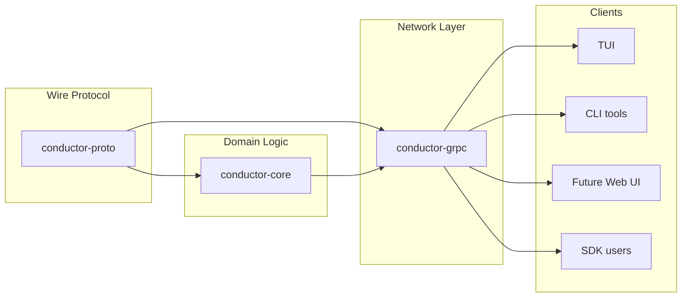

# Conductor gRPC Architecture

## Current State vs Target State

### Current Problems
1. `conductor-core` has methods that return proto types (e.g., `SessionManager::get_session_proto`)
2. Conversion logic is split between core and grpc crates
3. In-process mode allows clients to bypass the clean API and couple to internals

### Target Architecture

## 1. `conductor-proto`
* **What**: Only `.proto` files and tonic-generated code
* **Purpose**: Define the stable wire protocol that any client can depend on
* **Dependencies**: Just prost/tonic
* **Exports**: Generated message types, service traits

## 2. `conductor-core`
* **What**: Pure domain logic – LLM APIs, session management, validation, tool execution
* **Must NOT**:
  - Return or accept proto types in public APIs
  - Know about gRPC, networking, or UI concerns
  - Import conductor-grpc
* **Dependencies**: `tools`, `macros`, `conductor-proto` (only for basic type definitions)
* **Exports**: Domain types (Message, SessionConfig, etc.), SessionManager, AppCommandSink/AppEventSource traits

## 3. `conductor-grpc`
* **What**: Network transport layer
  - gRPC server implementation wrapping SessionManager
  - gRPC client implementing AppCommandSink/AppEventSource
  - ALL conversions between core domain types ↔ proto messages
  - **No business logic** – RemoteBackend / RemoteWorkspace live in core and depend only on `conductor-proto`
* **Key principle**: This is the ONLY crate that knows about both core types and proto types
* **Visibility**:
  - Export: GrpcClient (implements AppCommandSink/AppEventSource), GrpcServer
  - Hide: All conversion functions (pub(crate) only)
* **Dependencies**: `conductor-core`, `conductor-proto`, tonic

## 4. Clients
* Examples: `conductor-tui`, future web UI, Python SDK via grpcio
* **Single integration path**: Always go through conductor-grpc
  - Even "local" mode creates an in-memory gRPC channel
  - Ensures all clients use the same API surface
  - No direct access to conductor-core internals
* **Benefits**:
  - TUI is no longer "special" - just another gRPC client
  - Consistent behavior between local and remote modes
  - Can't accidentally couple to unstable internals

## Design Principles

1. **Clean dependency graph**: proto ← core ← grpc ← clients
2. **Single source of truth**: Proto defines wire format, core defines domain model, never mix them
3. **Explicit boundaries**: Conversions happen in exactly one place (conductor-grpc)
4. **No in-process shortcuts**: All clients go through the same API

## Migration TODOs

### Immediate (blocking the split)
1. Move all proto-returning methods from SessionManager to conductor-grpc ✅
2. Extract conversion code from conductor-core into conductor-grpc ✅
3. Remove the conductor_grpc::conversions import from core ✅
4. **Move RemoteBackend / RemoteWorkspace into conductor-core (depend on conductor-proto)** ✅
5. **Replace in-process mode with in-memory gRPC channel** ✅
6. **Ensure workspace compiles after migration** ✅

### Follow-up
1. Add roundtrip tests for all conversions
2. Version the proto package (e.g. conductor.v1)
3. Document which proto fields are stable vs experimental
4. Consider moving some core types (like Model enum) to a shared crate if needed

## Testing Strategy

1. **Unit tests**: Core logic without any proto types
2. **Conversion tests**: Property-based testing for core↔proto roundtrips
3. **Integration tests**: Full gRPC client/server with real network calls
4. **Compatibility tests**: Ensure old proto clients work with new servers